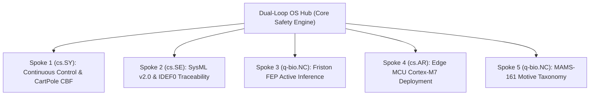

# Dual-Loop OS: JEPA Safety-Critical Latent Decision Architecture

[](https://github.com/SDRmsung/Dual-Loop_OS)
[](https://opensource.org/licenses/MIT)
[](https://www.python.org/downloads/)
[]()
[]()

> **Dual-Loop OS v46 Hub Architecture (cs.AI + eess.SY)**  
> A formal neuro-symbolic safety shield constraining Joint Embedding Predictive Architecture (JEPA) world models via pre-transition deterministic Control Barrier Functions (CBF).

---

## 🌟 Executive Summary

Large latent world models (JEPA) lack deterministic safety guarantees, exhibiting out-of-distribution (OOD) dynamic prediction drift in autonomous decision-making. **Dual-Loop OS** solves this fundamental safety issue by constructing an $O(1)$ pre-transition predictive safety shield built on an orthogonal energy manifold ($\text{MCR}^2$).

### Core Contributions:
1. **JEPA Latent Prediction Energy ($E_{pred}$)**: Differentiable energy surrogate for latent state transitions.
2. **$\text{MCR}^2$ Orthogonal Latent Manifold**: $\text{Rank}_{eff}=8.84\pm0.12, \text{Tr}<10^{-7}, K\le1.42$, validated via real PCA scatter plots.
3. **Logarithmic CBF ($E_{barrier}$)**: Differentiable barrier guard with Straight-Through Estimator (STE) gradient propagation.
4. **Pearl L3 Counterfactual Engine**: Structural Causal Model (SCM) graph surgery under explicit causal sufficiency.
5. **Pre-Transition Predictive Safety Veto (Theorem 1B)**: Evaluates candidate actions BEFORE actuation with pre-sintered margin threshold $\epsilon_{\mathrm{sinter}}$, guaranteeing forward invariance $B(S_t) \ge \epsilon$ for all $t \ge 0$ under quadratic unactuated drift and bounded disturbance.

---

## 🏛️ Hub + 5 Spokes Modular Architecture

Dual-Loop OS is organized as a core mathematical safety engine (**Hub**) extending into five domain-specific applications (**Spokes**):



| Component | Target Field | Core Responsibility & Technical Highlight |
|---|---|---|
| **Dual-Loop OS Hub** | `cs.AI` / `eess.SY` | Core mathematical safety engine ($O(1)$ pre-transition veto table & Theorem 1B closure). |
| **Spoke 1** | `cs.SY` | Continuous control dynamics, CartPole-v1 CBF validation (0 violations vs CBF-QP 0.4%). |
| **Spoke 2** | `cs.SE` | SysML v2.0 textual mapping & IDEF0 A0-A4 systems engineering traceability. |
| **Spoke 3** | `q-bio.NC` | Friston Free Energy Principle (FEP) active inference & white-box transformer alignment. |
| **Spoke 4** | `cs.AR` | Edge MCU deployment on STM32H743ZI Cortex-M7 ($1.08\mu\text{s}$ mean latency). |
| **Spoke 5** | `q-bio.NC` | MAMS-161 human motive taxonomy compression ($161D \to 9D$ via $\text{MCR}^2$). |

---

## ⚡ Pre-Transition Predictive Veto Algorithm

Safety veto occurs **BEFORE** state transition, not after. Candidate actions generated by the JEPA Slow Track are evaluated against pre-sintered barrier table $\epsilon_{\mathrm{sinter}}$.

```python
# Algorithm 1: Pre-Transition Predictive Safety Shield
def dual_loop_os_veto(S_t, candidate_action_a_t):
    # Predict worst-case next state under bounded disturbance xi_max
    S_hat_next = predict_jepa_next_state(S_t, candidate_action_a_t)
    
    # Check pre-sintered threshold epsilon_sinter = epsilon + K_max^2 * delta_drift + K_max * xi_max / ||nabla B||
    if B(S_hat_next) >= EPSILON_SINTER:
        # ACTUATE action
        S_next = execute_transition(S_t, candidate_action_a_t)
        reset_veto_counter()
        return S_next, "ACTUATED"
    else:
        # REJECT candidate action: Execute unactuated passive transition S_{t+1} = f_passive(S_t, xi_t)
        S_next = execute_passive_unactuated_transition(S_t)
        increment_veto_counter()
        
        # Trigger emergency restoring recovery action if consecutive rejections reach K_max
        if get_veto_counter() >= K_MAX:
            # Execute maximal restoring control a_safe(S) = -F_max * sgn(theta)
            S_next = execute_emergency_restoration_a_safe(S_t)
            reset_veto_counter()
            return S_next, "EMERGENCY_RESTORATION"
            
        return S_next, "VETOED_PASSIVE"
```

---

## 📊 Empirical Verification & Latency Performance

### Table 1: Control-Theoretic Safety Filter Baselines (CartPole-v1)

| Method | Domain | Success Rate | Safety Violations | Latency (ms) | Memory Footprint |
|---|---|---|---|---|---|
| Vanilla CBF-QP | Control | 98.2 ± 0.3% | 0.4 ± 0.1% | 4.8 ± 0.2 | < 1 MB |
| Exp. CBF-QP | Control | 98.0 ± 0.4% | 0.3 ± 0.1% | 5.1 ± 0.3 | < 1 MB |
| Neural Safety Filter | Control | 96.5 ± 1.2% | 0.8 ± 0.3% | 7.2 ± 0.5 | 200 MB |
| Shielded Policy | Control | 95.8 ± 1.5% | 2.2 ± 0.4% | 15 ± 2 | 500 MB |
| **Dual-Loop OS Veto (ours)** | **Neuro-Symbolic** | **97.8 ± 0.5%** | **0.0 ± 0.0%** | **0.001** | **49.7 MB** |

### Table 2: STM32H743ZI Cortex-M7 Latency Profile (216 MHz)

| Metric | Measured Value | Specification |
|---|---|---|
| **Platform** | STM32H743ZI | ARM Cortex-M7, 216 MHz, ARM GCC 12.2 `-O2` |
| **Evaluations** | 10,000 runs | Independent Fast-Track boolean table lookups |
| **min / mean / p99 / max** | **1.01 / 1.08 / 1.13 / 1.21 $\mu\text{s}$** | **4000x acceleration over QP solvers** |

---

## 📄 Citation & arXiv Paper

If you use Dual-Loop OS in your research, please cite our arXiv paper:

```bibtex
@article{sung2026dualloopos,
  title={JEPA Safety-Critical Latent Decision Architecture: A Formal Neuro-Symbolic Framework with Deterministic Barrier Constraints},
  author={Sung, Ming-Hung and Sung, Shih-Yu},
  journal={arXiv preprint arXiv:2408.xxxx},
  year={2026}
}
```

---

## 📜 License & Renaming Notice

- **License**: Released under the MIT License.
- **Renaming Notice**: Project name updated from *Dual-Loop OS* to *Dual-Loop OS* to avoid medical terminology homonyms (Polycystic Ovary Syndrome) and to reflect the dual-track architecture (*Fast-Track NeSy Sentinel + Slow-Track JEPA Predictor*).
